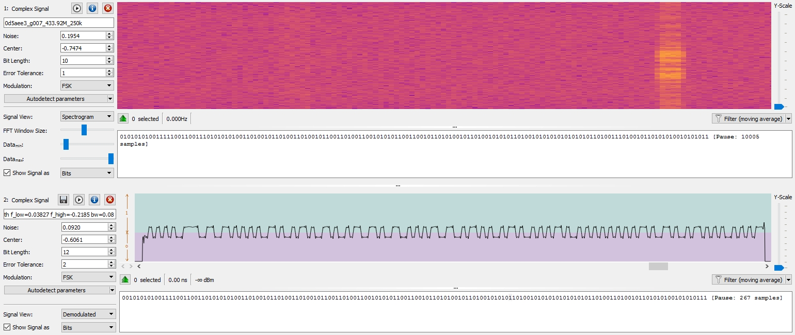

# Analysis of samples

## [Toyota_TPMS](../../ANALYSIS.md)

### [0d5aee3_g007_433.92M_250k.cu8](../0d5aee3_g007_433.92M_250k.cu8)



| Field              | Value               |
|:------             |:-----               |
| Sample Rate        | 250,000 samples/sec |
| Bit Length         | 12                  |
| Error Tolerance    | 2                   |
| Modulation         | FSK                 |

Signal Symbols:

```
0101010100111100110011010101010011010010110100110100101100110100110010101011001100101101010010110100101010110100101010101010101011010011010010110101010010101011
{160}553ccd54d2d34b34cab32d4b4ab4aaaad34b54ab
```

Decoded Logical Bits:

```
111100001101010110101110111000111101001010100010100000000101101010001000
{72}f0d5aee3d2a2805a88
```

rtl_433 Interpretation:

`rtl_433 -y {160}553ccd54d2d34b34cab32d4b4ab4aaaad34b54ab`

```
model     : Toyota       type      : TPMS          id        : f0d5aee3
status    : 128          pressure_PSI: 34.250      temperature_C: 29.000     mic       : CRC
```


### [0d681a0_g006_433.92M_250k.cu8](../0d681a0_g006_433.92M_250k.cu8)

`rtl_433 -r 0d681a0_g006_433.92M_250k.cu8`

```
model     : Toyota       type      : TPMS          id        : f0d681a0
status    : 128          pressure_PSI: 33.500      temperature_C: 25.000     mic       : CRC
```


`rtl_433 -r 0d68194_g008_433.92M_250k.cu8`

```
model     : Toyota       type      : TPMS          id        : f0d68194
status    : 128          pressure_PSI: 33.250      temperature_C: 23.000     mic       : CRC
```


### [0d681be_g009_433.92M_250k.cu8](../0d681be_g009_433.92M_250k.cu8)

`rtl_433 -r 0d681be_g009_433.92M_250k.cu8`

```
model     : Toyota       type      : TPMS          id        : f0d681be
status    : 128          pressure_PSI: 34.000      temperature_C: 27.000     mic       : CRC
```

### [0d68194_g008_433.92M_250k.cu8](../0d68194_g008_433.92M_250k.cu8)

`rtl_433 -r 0d68194_g008_433.92M_250k.cu8`

```
model     : Toyota       type      : TPMS          id        : f0d68194
status    : 128          pressure_PSI: 33.250      temperature_C: 23.000     mic       : CRC
```

