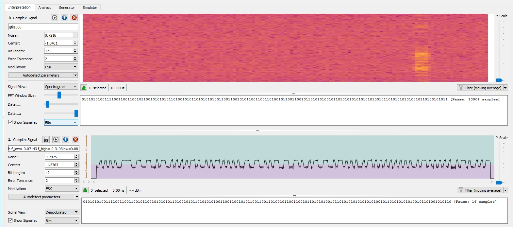
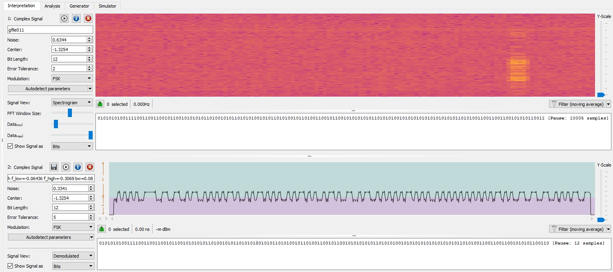
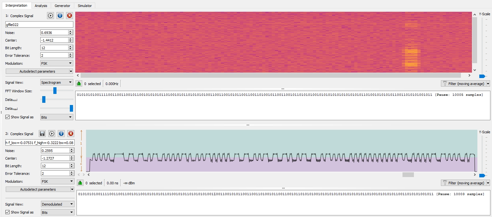
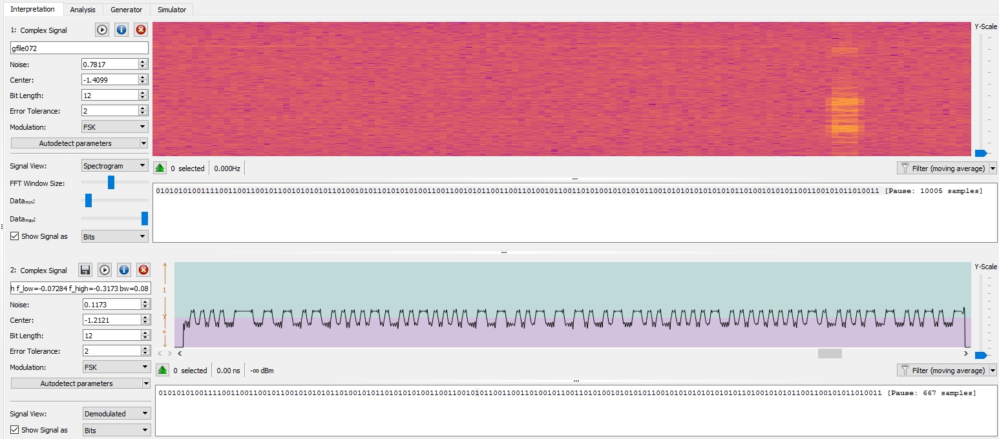

# Analysis of samples

See [README](README.md) for general signal info and decoding methodology.

## Toyota_TPMS/

[02/EXAMPLES.md](02/EXAMPLES.md)

[03/EXAMPLES.md](03/EXAMPLES.md)

[04/EXAMPLES.md](04/EXAMPLES.md)

### [gfile006.cu8](../gfile006.cu8)



| Field              | Value               |
|:------             |:-----               |
| Sample Rate        | 250,000 samples/sec |
| Bit Length         | 12                  |
| Error Tolerance    | 2                   |
| Modulation         | FSK                 |

Signal Symbols:
`0101010100111100110011001011001010101011010010101101010101001100110010101100110011010010110011001011010101001011010101010101010100101101010101010010110100101011`
`{160}553cccb2ab4ad54ccaccd2ccb54b55552d552d2b`

Data Symbols:
`00110011001011001010101011010010101101010101001100110010101100110011010010110011001011010101001011010101010101010100101101010101010010110100101011`
`{146}332caad2b55332b334b32d52d5554b554b4ac`

Decoded Logical Bits:
`111110110000101001000011111001111101011110100010100000000101000001010100`
`{72}fb0a43e7d7a2805054'

rtl_433 Interpretation:

`rtl_433 -y {160}553cccb2ab4ad54ccaccd2ccb54b55552d552d2b`

```
model     : Toyota       type      : TPMS          id        : fb0a43e7
status    : 128          pressure_PSI: 36.750      temperature_C: 29.000     mic       : CRC
```

### [gfile008.cu8](../gfile008.cu8)


| Field              | Value               |
|:------             |:-----               |
| Sample Rate        | 250,000 samples/sec |
| Bit Length         | 12                  |
| Error Tolerance    | 2                   |
| Modulation         | FSK                 |

Signal Symbols:
`0101010100111100110011001011001010101011010010101101010100110101010010101011001100101101001101010101001100110011010101010101010100101101010011010011010011010011`
`{160}553cccb2ab4ad5354ab32d35533355552d4d34d3`

Decoded Logical Bits:
`111110110000101001000110001000111101011000011111100000000101001101101101`
`{72}fb0a4623d61f80536d`

rtl_433 Interpretation:

`rtl_433 -y {160}553cccb2ab4ad5354ab32d35533355552d4d34d3`

```
model     : Toyota       type      : TPMS          id        : fb0a4623
status    : 128          pressure_PSI: 36.000      temperature_C: 23.000     mic       : CRC
```


### [gfile010.cu8](../gfile010.cu8)


| Field              | Value               |
|:------             |:-----               |
| Sample Rate        | 250,000 samples/sec |
| Bit Length         | 12                  |
| Error Tolerance    | 2                   |
| Modulation         | FSK                 |

Signal Symbols:
`0101010100111100110011001011001010101011010010101101010100110101010010101101010011010010110010101011010101010101010101010101010100101101010011010010110100101011`
`{160}553cccb2ab4ad5354ad4d2cab55555552d4d2d2b`

Decoded Logical Bits:
`111110110000101001000110001001001101011000100000000000000101001101010100`
`{72}fb0a4624d620005354`

rtl_433 Interpretation:

`rtl_433 -y {160}553cccb2ab4ad5354ad4d2cab55555552d4d2d2b`

```
model     : Toyota       type      : TPMS          id        : fb0a4624
status    : 128          pressure_PSI: 36.000      temperature_C: 24.000     mic       : CRC
```


### [gfile011.cu8](../gfile011.cu8)



| Field              | Value               |
|:------             |:-----               |
| Sample Rate        | 250,000 samples/sec |
| Bit Length         | 12                  |
| Error Tolerance    | 2                   |
| Modulation         | FSK                 |

Signal Symbols:
`0101010100111100110011001011001010101011010010101101010100101011010100101101001100101100101010101011010101001010101010101010101011010100110011001100101010110011`
`{160}553cccb2ab4ad52b52d32caab54aaaaad4cccab3`

Decoded Logical Bits:
`111110110000101001000100100101011101100000100010000000000100111111100011`
`{72}fb0a4495d822004fe3`

rtl_433 Interpretation:

`rtl_433 -y {160}553cccb2ab4ad52b52d32caab54aaaaad4cccab3`

```
model     : Toyota       type      : TPMS          id        : fb0a4495
status    : 128          pressure_PSI: 37.000      temperature_C: 28.000     mic       : CRC
```

### [gfile022.cu8](../gfile022.cu8)



| Field              | Value               |
|:------             |:-----               |
| Sample Rate        | 250,000 samples/sec |
| Bit Length         | 12                  |
| Error Tolerance    | 2                   |
| Modulation         | FSK                 |

Signal Symbols:
`0101010100111100110011001011001010101011010010101101010101001100110010101100110011010010110011001011010101001010101010101010101011010010101010110011010101001011`
`{160}553cccb2ab4ad54ccaccd2ccb54aaaaad2ab354b`

Decoded Logical Bits:
`111110110000101001000011111001111101011110100010000000000101000011100010`
`{72}fb0a43e7d7a20050e2`

rtl_433 Interpretation:

`rtl_433 -y {160}553cccb2ab4ad54ccaccd2ccb54aaaaad2ab354b`

```
model     : Toyota       type      : TPMS          id        : fb0a43e7
status    : 128          pressure_PSI: 36.750      temperature_C: 28.000     mic       : CRC
```


### [gfile072.cu8](../gfile072.cu8)



| Field              | Value               |
|:------             |:-----               |
| Sample Rate        | 250,000 samples/sec |
| Bit Length         | 12                  |
| Error Tolerance    | 2                   |
| Modulation         | FSK                 |

Signal Symbols:
`0101010100111100110011001011001010101011010010101101010101001100110010101100110011010010110011010100101010101100101010101010101011010010101011001100101011010011`
`{160}553cccb2ab4ad54ccaccd2cd4aacaaaad2accad3`

Decoded Logical Bits:
`111110110000101001000011111001111101011100100001100000000101000111100101`
`{72}fb0a43e7d7218051e5`

rtl_433 Interpretation:

`rtl_433 -y {160}553cccb2ab4ad54ccaccd2cd4aacaaaad2accad3`

```
model     : Toyota       type      : TPMS          id        : fb0a43e7
status    : 128          pressure_PSI: 36.500      temperature_C: 27.000     mic       : CRC
```
